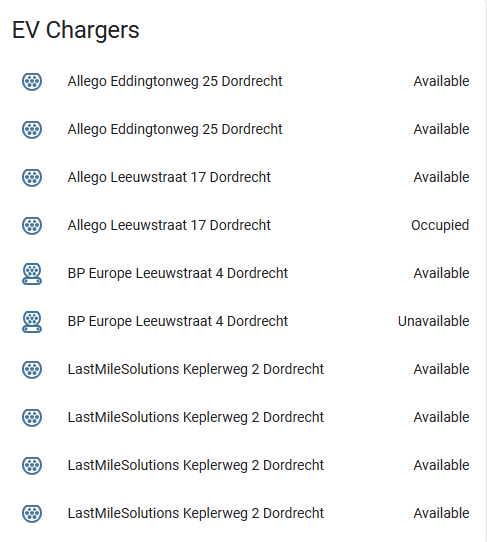
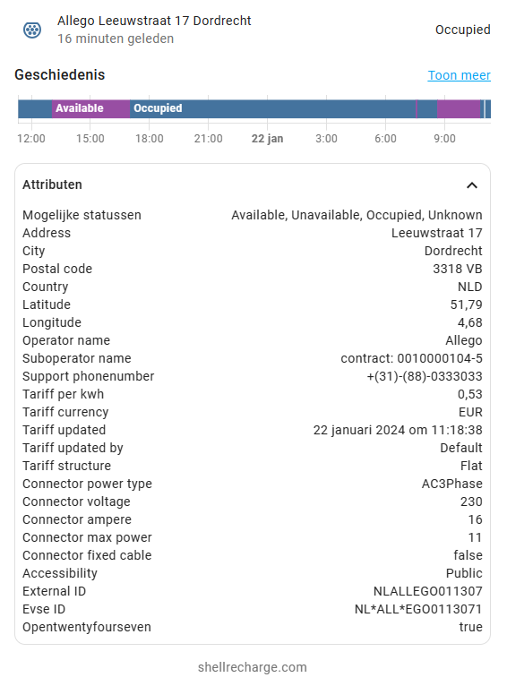
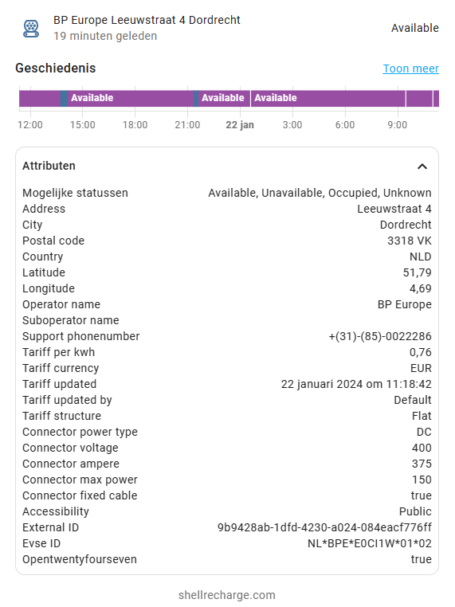

# Shell Recharge

The Shell Recharge integration allows you to expose data from EV chargers on shellrecharge.com to Home Assistant.

[![GitHub Release][releases-shield]][releases]
[![GitHub Activity][commits-shield]][commits]
[![License][license-shield]](LICENSE)

![Project Maintenance][maintenance-shield]
[![Sponsor][sponsor-shield]][sponsor]

**This integration will set up the following platforms.**

| Platform | Description                                                    |
| -------- | -------------------------------------------------------------- |
| `sensor` | Contains detailed information for each EV charger at location. |

## Installation

### HACS - Recommended

- Have [HACS](https://hacs.xyz) installed, this will allow you to easily manage and track updates.
- Goto Custom Repository menu in HACS, paste https://github.com/cyberjunky/home-assistant-shell_recharge as URL and select Integration as type.
- Search for 'Shell Recharge' in HACS.
- Click the Download button at the bottom of the page of the found integration.
- Restart Home Assistant.
- Under Services -> Devices & services click the Add Integration button, search for Shell Recharge.
- Configure the integration using the instructions below.

### Manual - without HACS

- Copy the directory `custom_components/shell_recharge` to your `<config dir>/custom_components` directory.
- Restart Home Assistant.
- Configure the integration using the instructions below.

## Configuration

Find the EV charger(s) you want to monitor here: https://shellrecharge.com/en-gb/find-a-charge-point look for the Serial number under details section.
Then use Add device within Home Assistant and enter the Serial number in the form.

## Screenshots

| Chargers Overview                              | AC Charger Details                             | DC Charger Details                                |
| ---------------------------------------------- | ---------------------------------------------- | ------------------------------------------------- |
|  |  |  |

## Debugging

Add the relevant lines below to the `configuration.yaml`:

```yaml
logger:
  default: info
  logs:
    custom_components.shell_recharge: debug
```

<!---->

## Contributions are welcome

If you want to contribute to this please read the [Contribution guidelines](CONTRIBUTING.md)

---

[commits-shield]: https://img.shields.io/github/commit-activity/y/cyberjunky/home-assistant-shell_recharge.svg?style=for-the-badge
[commits]: https://github.com/cyberjunky/home-assistant-shell_recharge/commits/main
[license-shield]: https://img.shields.io/github/license/cyberjunky/home-assistant-shell_recharge.svg?style=for-the-badge
[maintenance-shield]: https://img.shields.io/badge/maintainer-%40cyberjunky-blue.svg?style=for-the-badge
[releases-shield]: https://img.shields.io/github/release/cyberjunky/home-assistant-shell_recharge.svg?style=for-the-badge
[releases]: https://github.com/cyberjunky/home-assistant-shell_recharge/releases
[sponsor-shield]: https://img.shields.io/static/v1?label=Sponsor&message=%E2%9D%A4&logo=GitHub&color=%23fe8e86
[sponsor]: https://github.com/sponsors/cyberjunky
